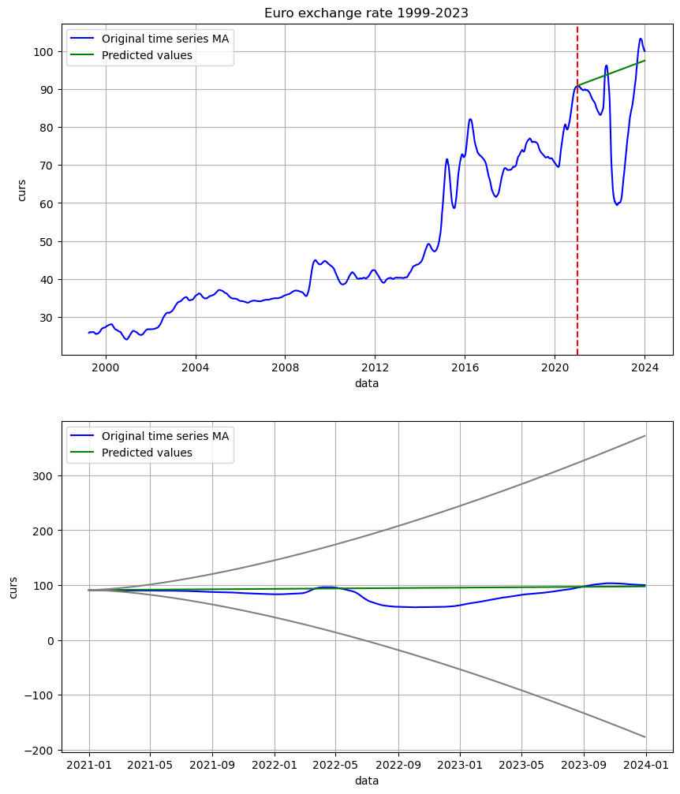
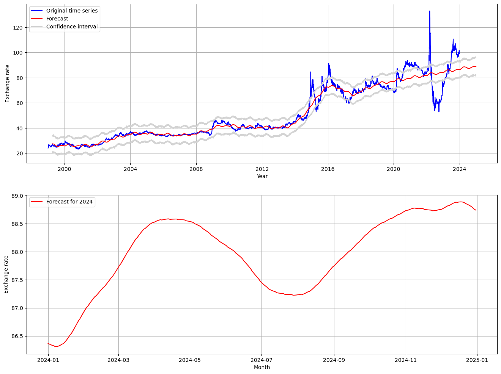

# 
 **Euro exchange rate forecast for 2024**

The project solves the problem of predicting the exchange rate of the Euro against the ruble. The time series is based on data from the Central Bank of Russia on the dynamics of the Euro exchange rate in 1999 - 2023.

Forecasting the exchange rate: Predicting the exchange rate of the euro can help financial institutions such as banks and investment firms in planning and making decisions about foreign exchange transactions and investments. It can also help businesses and individuals prepare for changes in currency values and adapt their budgets accordingly.

+ Market Analysis: Euro exchange rate predictions can be used to analyze the current state and predict future trends in the foreign exchange market. This helps market participants determine when it is best to buy or sell currencies, as well as understand the reasons for changes in rates.

+ Risk management: Knowing future changes in the euro can help organizations minimize the risks associated with foreign exchange transactions and investments. For example, companies can hedge their currency risks by entering into contracts for the future purchase or sale of a currency at a specific rate.

+ Make informed decisions: Euro exchange rate predictions can help individuals and businesses make informed decisions about purchases, investments and other currency transactions. Knowing future rate changes can help them plan their finances and make more informed decisions.

## Models used for prediction

### 1. **ARIMA** 

MAE: 11.698

MAPE: 0.167

MSE: 273.656

The ARIMA model is wrong by an average of 11.7 rubles.

### 2. **Prophet** 

MAE: 10.665

MAPE: 0.14

MSE: 159.531

The Prophet model is wrong by an average of 10.67 rubles.

